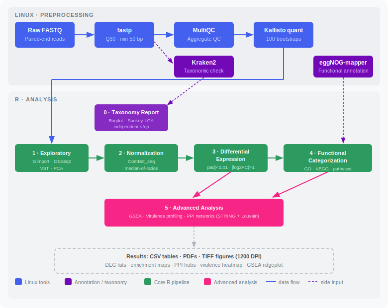

# RNA-seq Analysis Cookbook for Bacteria 🧬

A reproducible, step-by-step pipeline for RNA-seq transcriptomic analysis in bacteria, with specific considerations for *Pectobacterium* and other gram-negative phytopathogens. Designed as a practical guide for research groups working with bacterial transcriptomics.

## Overview

This cookbook covers the full workflow from raw reads to functional interpretation:



| Stage | Tool(s) | Output |
|---|---|---|
| Quality control | fastp · MultiQC | Trimmed reads · QC report |
| Taxonomic check | Kraken2 · Krona | Species composition report |
| Quantification | Kallisto | Transcript abundance tables |
| Exploratory | tximport · DESeq2 · VST | PCA plots |
| Batch correction | ComBat_seq (sva) | Corrected count matrix |
| Normalization | DESeq2 median-of-ratios | Normalized counts |
| Diff. expression | DESeq2 · EnhancedVolcano | DEG list · Volcano · Heatmap |
| Enrichment | clusterProfiler · pathview | GO/KEGG dot plots · Pathway maps |
| Advanced | GSEA · STRINGdb · igraph | Ridgeplot · PPI network · Virulence heatmap |

## Repository Structure

```
rnaseq-bacteria-cookbook/
├── 00_preprocessing_linux/      # Shell scripts for WSL/Linux preprocessing + R package setup
├── 01_taxonomic_assessment/     # R Markdown: Kraken2 report evaluation
├── 02_exploratory_analysis/     # R Markdown: QC and data exploration
├── 03_correction_normalization/ # R Markdown: batch correction and normalization
├── 04_differential_expression/  # R Markdown: DEG analysis + example data
├── 05_functional_annotation/    # R Markdown: GO, KEGG, and PPI enrichment
├── 06_advanced_analysis/        # R Markdown: GSEA, trait profiling, network hubs
└── reference/                   # Notes on reference files and databases
```

## Requirements

### Linux / WSL
| Tool | Version tested | Purpose |
|------|---------------|---------|
| fastp | ≥ 0.23 | Quality control and trimming |
| Kraken2 | ≥ 2.1 | Taxonomic classification |
| KronaTools | ≥ 2.8 | Taxonomic visualization |
| MultiQC | ≥ 1.14 | Aggregate QC report |
| Kallisto | ≥ 0.50 | Pseudoalignment and quantification |

### R packages
See `00_preprocessing_linux/00_install_packages.Rmd` for the full installation script.

Core packages: `DESeq2`, `sva`, `tximport`, `EnhancedVolcano`, `clusterProfiler`, `enrichplot`, `pathview`, `STRINGdb`, `KEGGREST`, `ggraph`/`tidygraph`/`igraph`.

### Functional annotation
This pipeline uses [eggNOG-mapper](http://eggnog-mapper.embl.de/) output (`annotation.tsv`) for GO/KEGG term mapping, since many non-model bacteria lack a curated Bioconductor organism package. Generate this file by submitting your protein FASTA to the eggNOG-mapper web server or standalone tool.

## Bacterial-specific considerations

- **Transcript reference**: Use the coding sequences (CDS) from NCBI RefSeq for your strain, not a eukaryotic transcriptome. Kallisto works with `.fna` CDS files for bacteria.
- **No introns**: Splicing-aware aligners (STAR, HISAT2) are unnecessary; pseudoalignment with Kallisto is appropriate and faster.
- **Taxonomic QC**: The Kraken2 + taxonomic assessment step (`01_taxonomic_assessment/`) is essential to confirm reads map to your target organism and detect contamination before quantification.
- **Annotation strategy**: For organisms without a curated Bioconductor annotation package, eggNOG-mapper provides GO/KEGG mappings directly from protein sequences — this is the approach used throughout `05_functional_annotation/` and `06_advanced_analysis/`.
- **Trait-based gene filtering**: Section 4 of `06_advanced_analysis` uses keyword matching against gene descriptions to flag genes relevant to a specific biological question (e.g., virulence factors, stress response). Adjust the keyword list to your own research question — this pattern generalizes to any trait of interest.

## How to use this cookbook

1. Clone this repository
2. Run the Linux preprocessing scripts in order (`00_preprocessing_linux/`)
3. Create a new RProject in the root folder and set your working directory to the scripts folder
4. Run R Markdown files in numerical order
5. Each `.Rmd` renders to a self-contained PDF report

## Citation

If you use this pipeline in your research, please cite:

> López-Chablé, E.U. (2026). *RNA-seq Analysis Cookbook for Bacteria* (v1.0.0). Zenodo. https://doi.org/10.5281/zenodo.20849957

## AI disclosure

Portions of this code were developed with AI assistance (Gemini, GitHub Copilot) and manually validated, debugged, and adapted by the author.

## Author

**Edgard Uriel López Chablé**  
QFB Student, 6th semester  
Universidad Autónoma de Querétaro (UAQ)  
Junior Researcher 

## License

MIT License — free to use and adapt with attribution.
